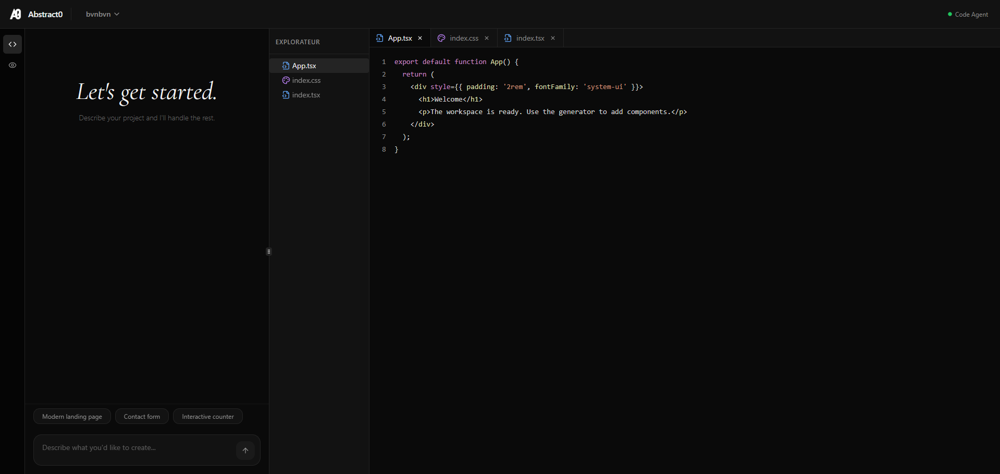

Abstract0
===========

LLM-driven code sandbox: FastAPI backend using Mistral AI agents and a Vite + React frontend that streams files into Sandpack.
This app generates React/Vite websites using AI; current agent: Devstral 2 (devstral-small-2507).

Architecture
------------
- Backend: FastAPI with Mistral AI SDK (beta conversations API) for JSON-only agent responses.
- Frontend: Vite + React UI with Sandpack workspace orchestration.

Interface Example
-----------------


API
---
Base URL: `http://localhost:8000`

Endpoints:
- `GET /health` -> `{ "status": "ok", "message": "Backend is running" }`
- `POST /generate`
	- Request: `{ "prompt": string, "context": [{ "role": "user"|"assistant", "content": string }] }`
	- Response: `{ "files": { "path": "content" }, "message": "summary" }`

Example:
```json
{
	"prompt": "Generate a simple App",
	"context": [{"role": "user", "content": "Use TypeScript"}]
}
```

Environment
-----------
Required:
- `MISTRAL_API_KEY` - Your Mistral AI API key
- `MISTRAL_AGENT_ID` - Your Mistral AI Agent ID (configured in Mistral AI Studio)

Optional:
- `VITE_API_BASE_URL` (frontend, default in compose is `http://localhost:8000`)

Development (Docker)
--------------------
```bash
MISTRAL_API_KEY=... MISTRAL_AGENT_ID=... docker compose up --build
```

Ports:
- Backend: `8000`
- Frontend: `8080`

Development (Local)
-------------------
Backend (uv):
```bash
cd backend
uv sync
uv run uvicorn main:app --host 0.0.0.0 --port 8000 --reload
```

Frontend:
```bash
cd frontend
npm install
npm run dev
```

Notes
-----
- The backend uses Mistral AI's beta conversations API with a custom agent configured in Mistral AI Studio.
- The agent is instructed to return JSON only; markdown fences are stripped if present.
- Agent configuration can be found in [backend/prompt](backend/prompt) (for reference when setting up the agent in Mistral AI Studio).
- The backend implementation is in [backend/main.py](backend/main.py).
